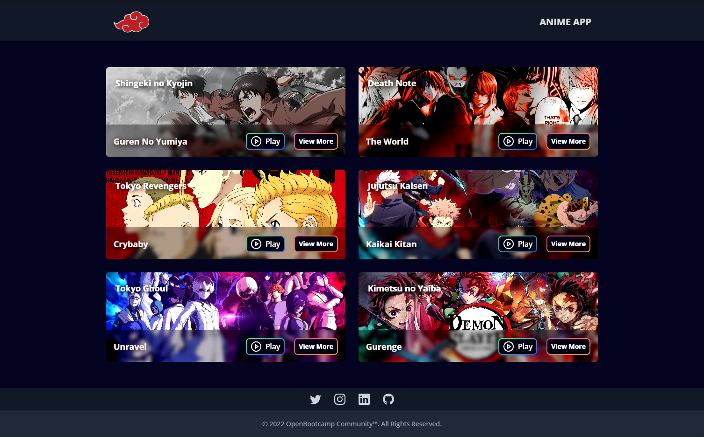

# ANIME APP PROJECT

## Tabla de Contenidos

- [Preview](#preview)
  - [Links](#links)
- [Proceso](#proceso)
  - [Construido con](#construido-con)
  - [Recursos Utilizados](#recursos-utilizados)
- [Autor](#Autor)

## Preview

### Screenshot

## Proyecto

Este proyecto fue realizado con la participación de los integrantes de OpenBootcamp, y es parte de una dinámica llamada "Weekend apps"

### Links

- Repositorio: [Solution](https://github.com/fabioalcocer/anime-app.git)
- Live Site URL: [Live App](https://anime-app-ob.netlify.app/)

## Proceso

### Construido con:

- Mobile-first workflow
- Responsive Design
- Flex Layout
- React
- Tailwind

### Recursos Utilizados

- [Tailwind](https://tailwindcss.com/docs/)
- [Cloudinary](https://cloudinary.com/)
- [Audio Web API's](https://developer.mozilla.org/en-US/docs/Web/API/HTMLAudioElement/Audio)
- [MDN Web Docs](https://developer.mozilla.org/es/docs/Web)

## Autor

### OpenBootcamp Community

- Bootcamp - [OpenBootcamp](https://bit.ly/3E5AGBt)
- Twitter - [@Open_Bootcamp](https://twitter.com/Open_Bootcamp)
- LinkedIn - [@Open_Bootcamp](https://www.linkedin.com/school/openbootcamp-escuela/)
- GitHub - [@fabioalcocer](https://github.com/fabioalcocer/)
